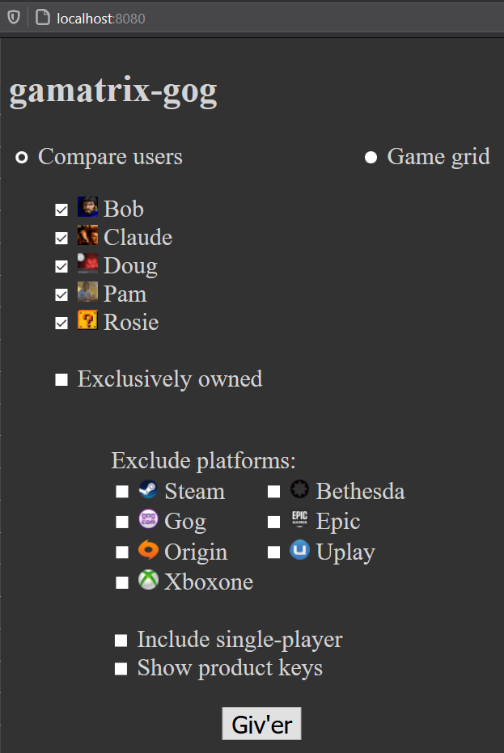
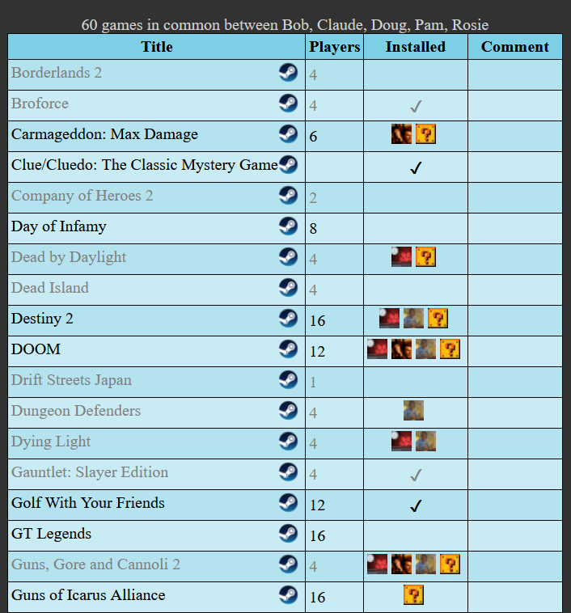
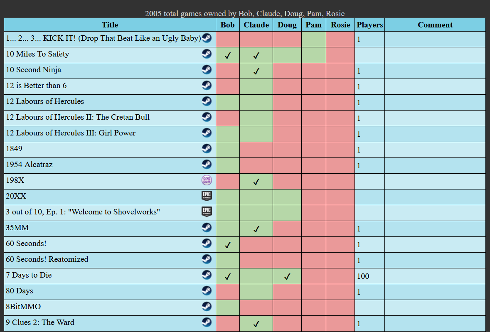

# gamatrix-gog

[](https://github.com/eniklas/gamatrix-gog/actions/workflows/ci.yml)

* [Quick start](#quick-start)
* [Introduction](#introduction)
    * [Features](#features)
    * [Screen shots](#screen-shots)
        * [Front page](#front-page)
        * [Game list](#game-list)
        * [Game grid](#game-grid)
* [Usage](#usage)
    * [Command-line mode](#command-line-mode)
    * [Server mode](#server-mode)
* [Configuration](#configuration)
    * [IGDB](#igdb)
* [Running in Docker](#running-in-docker)
    * [Restricting access](#restricting-access)
    * [Allowed CIDRs](#allowed-cidrs)
    * [iptables](#iptables)
* [Contributing](#contributing)

## Quick start

Jump to [command-line mode](#command-line-mode) or [building with Docker](#running-in-docker).

## Introduction

gamatrix-gog is a tool to compare the games owned by several users, and list all the games they have in common. Since GOG Galaxy supports almost all major digital distribution platforms through integrations, it's a great service for aggregating most of your games in one place. gamatrix-gog uses the sqlite database that GOG Galaxy stores locally to pull its data from; users can upload their DBs via the main page.

The name comes from [gamatrix](https://github.com/d3r3kk/gamatrix), another tool for comparing games. This project may eventually be integrated into it.

### Features

- compares the game libraries of an arbitrary number of users, with several filtering options
- multiplayer support and max players autopopulated from IGDB when available
- configuration via YAML file and/or command-line options
- small (< 150MB) Docker container
- IP whitelisting support
- ability to upload DBs

### Screen shots

#### Front page

Select your search criteria from the front page:



#### Upload DB

Upload a new GOG DB. Only files with a `.db` extension are allowed; the requesting IP is used to identify the uploader and name the target file correctly. To upload from a script, you can download [curl for Windows](https://curl.se/windows/) and run the following batch script, replacing `your-gamatrix-gog-url` with your server's DNS name or IP address:

```bat
curl -F file=@"C:\ProgramData\GOG.com\Galaxy\storage\galaxy-2.0.db" http://<your-gamatrix-gog-url>/compare?option=upload
pause
```

#### Game list

The `Game list` option provides a list of games owned by the selected users:



- titles supporting fewer players than selected are greyed out
- under `Installed`, a check mark indicates all players have the game installed; otherwise the names (or profile pics, if available) of the users that have the game installed are shown

#### Game grid

The Game grid option shows all games owned by the selected users



- green cells indicate the user owns the game, red indicates they don't
- a check mark means the user has the game installed

## Usage

```pre
usage: gamatrix-gog.py [-h] [-a] [-c CONFIG_FILE] [-d] [-i INTERFACE] [-I] [-p PORT] [-s] [-u [USERID [USERID ...]]] [db [db ...]]

Show games owned by multiple users.

positional arguments:
  db                    the GOG DB for a user; multiple can be listed

optional arguments:
  -h, --help            show this help message and exit
  -a, --all-games       list all games owned by the selected users (doesn't include single player unless -I is used)
  -c CONFIG_FILE, --config-file CONFIG_FILE
                        the config file to use
  -d, --debug           debug output
  -i INTERFACE, --interface INTERFACE
                        the network interface to use if running in server mode; defaults to 0.0.0.0
  -I, --include-single-player
                        Include single player games
  -p PORT, --port PORT  the network port to use if running in server mode; defaults to 8080
  -s, --server          run in server mode
  -u [USERID [USERID ...]], --userid [USERID [USERID ...]]
                        the GOG user IDs to compare
  -U, --update-cache    update cache entries that have incomplete info
  -v, --version         print version and exit
```

`db`: a GOG database to use. You can usually find a user's DB in `C:\ProgramData\GOG.com\Galaxy\storage\galaxy-2.0.db`. Multiple DBs can be listed. Not compatible with `-u`.

`-a/--all-games`: list all the multiplayer games owned by the selected users (user selection is covered below). Use with `-I` to include single-player games too.

`-c/--config-file`: the YAML config file to use. You don't need a config file, but you'll likely want one. See [configuration](#configuration) for details.

`-d/--debug`: enable debug messages.

`-I/--include-single-player`: include single-player games; by default, only multiplayer games are shown.

`-s/--server`: run in server mode. This will use Flask to serve a small web page where you can select the options you want, and will output the results there.

`-u/--userid`: a list of GOG user IDs to compare. The IDs must be in the [config file](#configuration). You can find the user ID by running `sqlite3 /path/to/galaxy-2.0.db "select * from Users;"`. If you use this option, you can't list DBs; they must be provided for the user IDs in the config file.

`-U/--update-cache`: pull info from IGDB for titles that previously got incomplete data, e.g. no info on multiplayer support, or no max player data. For instance, if you contribute max player info for a title in IGDB, once it's approved you can use this to pull it into your cache.

### Command-line mode

Command-line mode lists the output to a terminal, and doesn't use Flask. It's a good way to get copy/pastable titles to put into the config file for titles you want to hide or add metadata for. This mode is not developed as heavily as server mode, so may lag behind in features. To run, clone this repo and:

**1. Setup your virtual environment:**

```bash
python3 -m venv venv
. venv/bin/activate
```

_For our Windows friends:_

```pwsh
py -3 -m venv venv
.venv/Scripts/Activate.ps1
```

**2. Install dependencies:**

```bash
python -m pip install -U pip
python -m pip install -r requirements.txt
./gamatrix-gog.py
```

**Note:** Python 3.7+ is recommended. Dictionaries are assumed to be ordered, which is a 3.7+ feature.

### Server mode

If you use the `-s` option or set `mode: server` in the [config file](#configuration), a Flask web server is started and runs until the script is killed. This serves a web page with a check box for all users defined in the config file; users can select who they want to compare and a table is generated for the matching games. There is also a game grid layout that shows all games with color-coded cells indicating who owns which games.

Server mode is the intended use case, and supports all options, unlike CLI mode, which may not.

## Configuration

A YAML file provides the runtime configuration; by default, this is `config.yaml` in the same directory as the script, but this can be overridden with the `-c` option. See the annotated [sample file](config-sample.yaml) or the [Windows flavour of this file](config-sample-windows.yaml) for an explanation of the format.

### IGDB

[IGDB](https://www.igdb.com) will be used to pull multiplayer info if you have the needed credentials. See [this page](https://api-docs.igdb.com/#account-creation) for instructions on getting a client ID and secret, and put these in your config file as `igdb_client_id` and `igdb_client_secret`. Once this is set up, IGDB will be checked for all titles the first time they're processed, and if available, will categorize the title as multiplayer or single player, and set the maximum players. Note that this takes about a second per title, so the first time you use it, it can take a long time. The data is saved to disk in a cache file, which is read each time gamatrix-gog is launched, so once the cache is populated it's quite fast.

gamatrix-gog respects the IGDB rate limit and auto-renews your access token, so once you set your ID and secret in your config you should be good to go.

## Running in Docker

A [Dockerfile](Dockerfile) is provided for running gamatrix-gog in a container. Build it with:

```bash
docker build -t gamatrix-gog .
```

Then run it:

**Linux/MacOS:**

```bash
docker run -d --name gamatrix-gog -p 8080:80/tcp \
-v /path/to/gog_dbs:/usr/src/app/gog_dbs \
--mount type=bind,source=/path/to/.cache.json,target=/usr/src/app/.cache.json \
--mount type=bind,source=/path/to/config.yaml,target=/usr/src/app/config/config.yaml,readonly \
gamatrix-gog
```

**Windows:**

```pwsh
C:\Users\me> docker --name gamatrix-gog -p 8080:80/tcp -v C:\Users\me\dev\gamatrix-gog-dbs:/usr/src/app/gog_dbs -v C:\Users\me\dev\gamatrix-gog\.cache.json:/usr/src/app/.cache.json -v C:\Users\me\dev\gamatrix-gog\derek-config.yaml:/usr/src/app/config/config.yaml gamatrix-gog
```

Now you should be able to access the web page. If not, use `docker logs` to see what went wrong. The DBs are read on every call, so you can update them and they'll be used immediately. If you change the config file you'll need to restart the container for it to take effect.

### Restricting access

Flask is not a production-grade web server, and some people may not like their GOG DBs being exposed to the open Internet (I'm not aware of anything more personal in there than user IDs and game info, but I have not exhaustively checked by any means, so better safe than sorry). If you want to make the service only accessible to your friends, you have a couple options.

#### Allowed CIDRs

You can add CIDRs to `allowed_cidrs` in the config file, as shown in the [sample config](config-sample.yaml). If this is used, any IP not in those CIDR blocks will get a 401 Unauthorized. If this is not defined or is empty, all IPs are allowed.

#### iptables

You can also block access with iptables. Network access is best handled at the network layer, not the application layer, so this is the more secure method, but more complicated. I use Ubuntu 18.04, so YMMV:

Create a new chain called gamatrix:

```pre
# iptables -N gamatrix
```

Allow access to your friends' IPs, and your own internal network:

```pre
# for cidr in 192.168.0.0/24 1.2.3.4 5.6.7.8; do iptables -A gamatrix --src $cidr -j ACCEPT ; done
```

Drop everyone else that tries to reach gamatrix-gog (be sure to use the right port):

```pre
# iptables -A gamatrix -m tcp -p tcp --dport 80 -j DROP
```

Return to the calling chain if none of the rules applied:

```pre
# iptables -A gamatrix -j RETURN
```

Finally, insert your new chain into the `DOCKER-USER` chain:

```pre
# iptables -I DOCKER-USER 1 -j gamatrix
```

You final configuration should look like this:

```pre
# iptables -L DOCKER-USER
Chain DOCKER-USER (1 references)
target     prot opt source               destination
gamatrix   all  --  anywhere             anywhere
RETURN     all  --  anywhere             anywhere

# iptables -L gamatrix
Chain gamatrix (1 references)
target     prot opt source               destination
ACCEPT     all  --  192.168.0.0/24       anywhere
ACCEPT     all  --  1.2.3.4              anywhere
ACCEPT     all  --  5.6.7.8              anywhere
DROP       tcp  --  anywhere             anywhere             tcp dpt:http
RETURN     all  --  anywhere             anywhere
```

Save it so it persists after reboot:

```pre
# apt install iptables-persistent
# iptables-save > /etc/iptables/rules.v4
```

Now you can open the port on your router. For more information on using iptables with Docker, see [here](https://docs.docker.com/network/iptables/).

## Contributing

PR's welcome! If you're making nontrivial changes, please include test output if possible. Update [version.py](version.py) following [SemVer](https://semver.org/) conventions.